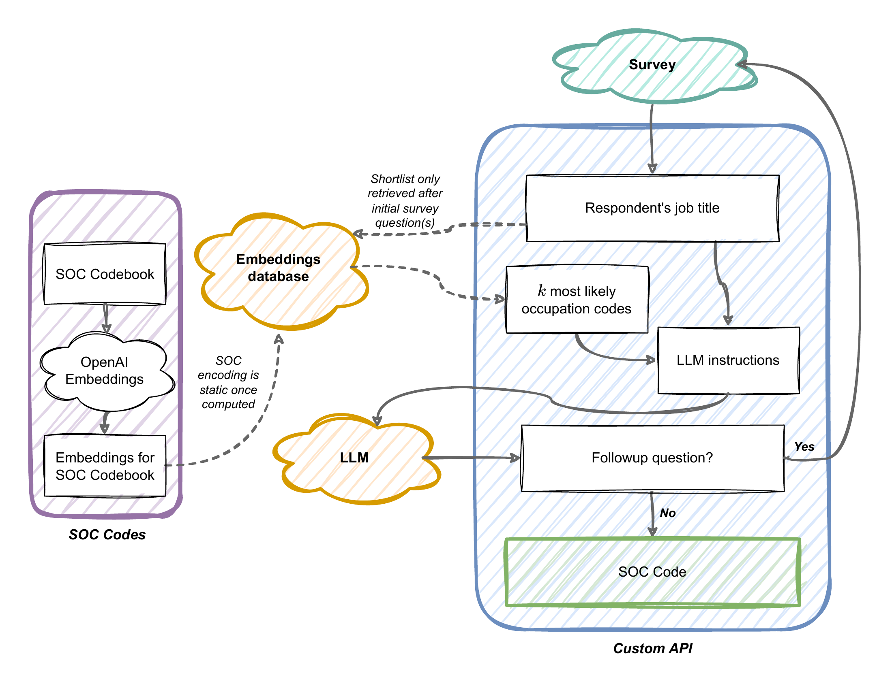
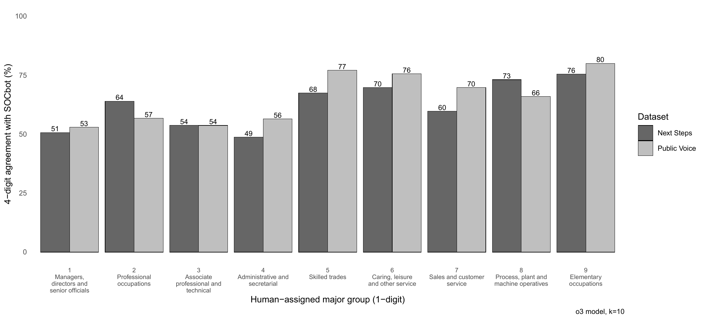
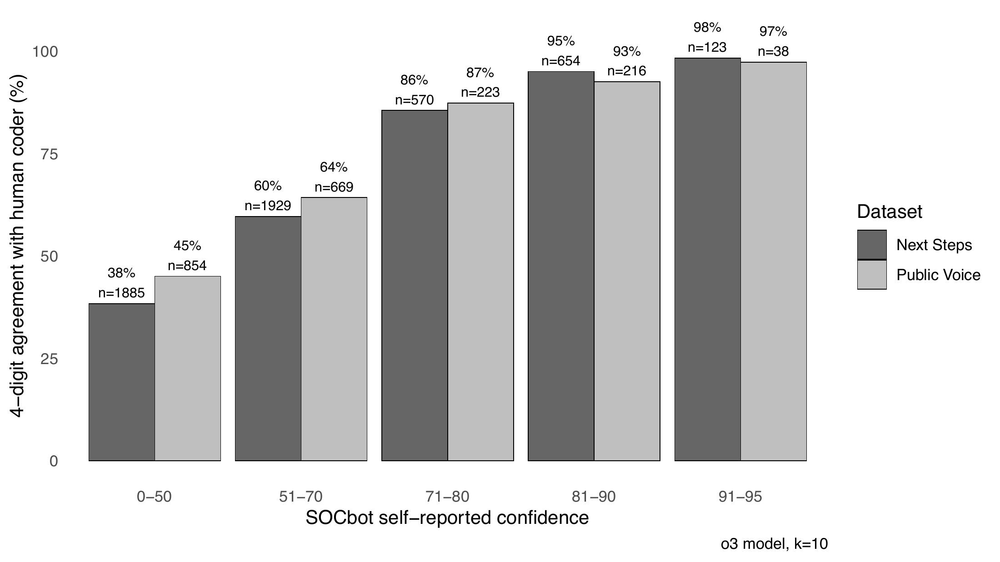
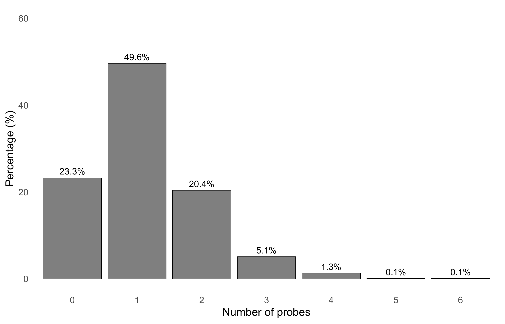
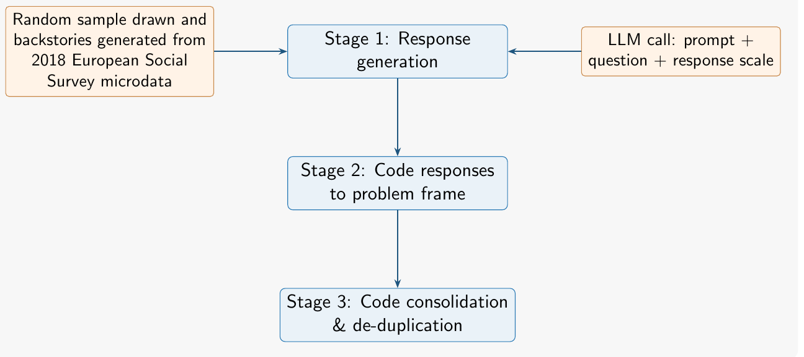

## {.slide}

```{=html}
<div class="title">Generative AI and the future<br>of survey measurement</div>
<hr class="rule-orn">
<div style="font-size:40px; font-weight:600; margin-top:52px;">Patrick Sturgis</div>
<div class="caption" style="font-size:30px; margin-top:12px;">Department of Methodology, London School of Economics</div>
<div class="caption" style="font-size:30px; margin-top:34px;">ESS and NatCen Survey Methodology Seminar Series &middot; 15 September 2026</div>
<div class="logos"></div>
```

::: {.notes}
0.0–0.5 minutes.

Online seminar, 12:00 to 13:00 BST. Forty minutes for the talk and five for discussion.
:::

---

## {.slide}

```{=html}
<div class="kicker">This talk</div>
<div class="head" style="font-size:58px; max-width:1560px;">LLMs may transform many parts of survey research. Their largest contribution may be to <span class="accent">measurement</span>, alongside existing methods.</div>
<div class="panelrow" style="width:1620px; margin-top:50px;">
<div class="panel"><div class="pname">Occupational coding</div><p style="font-size:36px;">SOCbot. An LLM inside the survey assigns SOC2020 codes and asks follow-up questions where the answer leaves the code ambiguous.</p></div>
<div class="panel"><div class="pname">Questionnaire pretesting</div><p style="font-size:36px;">Cogbot. LLMs simulate cognitive interviewing and expert review to find flaws in draft questions before fieldwork.</p></div>
</div>
<div class="caption" style="font-size:28px; margin-top:44px;">ESRC Survey Futures project <em>Integrating Generative AI in Question Design Evaluation and Testing</em> (ES/X014150/1) &middot; with Tom Robinson and Laura Fung (LSE) and Caroline Roberts (Lausanne)</div>
```

::: {.notes}
0.5–2.0 minutes.

Set out the framing from the abstract. SOCbot is dynamic integration: the LLM interacts with the respondent during the interview. Cogbot is static integration: the LLM works on the questionnaire before fieldwork. Occupation coding comes first because its evaluation includes a live survey. Thank Verian for the Public Voice data, the Centre for Longitudinal Studies for Next Steps, and the ONS Data Science Campus for the ClassifAI work the classifier builds on. Wider programme collaborators: Mayca Minichino, Alice Rebecca Hamlyn and Alice McGee.
:::

---

## {.slide}

```{=html}
<div class="kicker">SOCbot &middot; Occupational coding</div>
<div class="head" style="font-size:62px; margin-bottom:44px;">Occupation is hard to measure</div>
<div class="rows" style="max-width:1560px;">
<div class="row fragment" style="font-size:42px; line-height:1.4; margin-bottom:26px;">Hundreds of occupations, described in technical terms. Open questions on title, tasks, industry and qualifications, coded after fieldwork.</div>
<div class="row fragment" style="font-size:42px; line-height:1.4; margin-bottom:26px;">Human coders agree 50&ndash;75% of the time at detailed levels. Vague or brief answers cause most of the disagreement.</div>
<div class="row fragment" style="font-size:42px; line-height:1.4;">Automated tools code after the fact and reach 57&ndash;68% agreement at unit-group level.</div>
</div>
<div class="history-takeaway fragment" style="width:1560px; margin-top:44px; font-size:38px;">SOCbot classifies in real time and asks for the information each answer is missing.</div>
```

::: {.notes}
2.0–3.5 minutes.

A short title may identify one occupation unambiguously and leave another unresolved. CASCOT, supervised learning and BERT or GPT-3 fine-tuning all classify existing text; none improves the text. The classifier component can also run offline on archived responses and be re-run with any model that accepts the OpenAI chat-completions interface. Source: SOCbot paper, sections 1 and 2.
:::

---

## {.slide}

```{=html}
<div class="kicker">SOCbot &middot; How it works</div>
<div class="head" style="font-size:56px; margin-bottom:30px;">Retrieve, classify, and probe when the code is ambiguous</div>
<div class="whitecard"></div>
```

::: {.notes}
3.5–5.5 minutes.

Walk through the figure: receive the job title, embed it (text-embedding-3-large), retrieve the k most similar SOC2020 unit-group codes by cosine similarity, ask the LLM to shortlist three, decide whether the information is adequate, return a code with a 0–100 confidence score or a targeted probe, then repeat. Retrieval limits cost and latency and keeps the model on topic. Probes are restricted to industry, tasks, qualifications and supervisory responsibility. Garbled titles trigger a clarification probe that re-runs retrieval. Early testing found the model over-cautious (asking a professor what subject they teach), hence the restriction. A fast non-reasoning model runs live because lags over a few seconds were noticeable; a reasoning model can re-classify the full transcript offline. Source: SOCbot paper, section 3.
:::

---

## {.slide}

```{=html}
<div class="kicker">SOCbot &middot; Study 1, archived responses</div>
<div class="head" style="font-size:56px; margin-bottom:30px;">Agreement with production coding</div>
<table class="tbl" style="width:1500px;">
<tr><th>Model</th><th class="n">Major</th><th class="n">Submajor</th><th class="n">Minor</th><th class="n">Unit</th></tr>
<tr><td>o4-mini (original)</td><td class="n">0.797</td><td class="n">0.754</td><td class="n">0.709</td><td class="n">0.599</td></tr>
<tr class="hi"><td>o3 (original)</td><td class="n">0.826</td><td class="n">0.786</td><td class="n">0.742</td><td class="n">0.624</td></tr>
<tr><td>Opus 4.6, no thinking</td><td class="n">0.809</td><td class="n">0.768</td><td class="n">0.726</td><td class="n">0.614</td></tr>
<tr><td>Opus 4.6, adaptive reasoning</td><td class="n">0.800</td><td class="n">0.762</td><td class="n">0.721</td><td class="n">0.614</td></tr>
<tr><td>GPT-5</td><td class="n">0.811</td><td class="n">0.769</td><td class="n">0.728</td><td class="n">0.608</td></tr>
<tr><td>gpt-oss-120b (open-weight)</td><td class="n">0.778</td><td class="n">0.733</td><td class="n">0.675</td><td class="n">0.558</td></tr>
<tr><td>gpt-oss-20b (open-weight)</td><td class="n">0.770</td><td class="n">0.724</td><td class="n">0.671</td><td class="n">0.547</td></tr>
</table>
<div class="caption" style="margin-top:28px;">Verian Public Voice, n = 2,000, job title and industry, retrieval k = 10. Comparator is CASCOT plus human adjudication. Next Steps (n = 5,162, o3): 0.796 major, 0.602 unit. Published human inter-coder agreement at unit level is 0.4&ndash;0.7.</div>
```

::: {.notes}
5.5–8.0 minutes.

Two archived surveys with existing production codes. The comparator is not pure human coding: CASCOT assigns codes above 0.7 confidence and humans adjudicate the rest. There is no true code, so this is agreement, not accuracy. Agreement falls from around 0.8 at major group to around 0.6 at unit group, in the middle of the human range. Increasing k from 10 to 30 adds almost nothing. The three commercial frontier models cluster within 1.6 points at unit level, inside the bootstrap interval. Adaptive reasoning on Opus 4.6 gives no gain at about 14% higher cost. The open-weight models trail by five to eight points; the six-fold parameter increase from 20B to 120B closes about one point. Source: SOCbot paper, Table 1.
:::

---

## {.slide}

```{=html}
<div class="kicker">SOCbot &middot; Study 1</div>
<div class="head" style="font-size:56px; margin-bottom:30px;">Disagreement concentrates where human coders also disagree</div>
<div class="whitecard"></div>
<div class="caption" style="margin-top:24px;">Unit-group agreement by the comparator&rsquo;s major group. o3, k = 10.</div>
```

::: {.notes}
8.0–9.5 minutes.

Managerial (group 1), administrative (group 4) and associate professional (group 3) occupations have the lowest agreement, 49–57%. Skilled trades, caring, operatives and elementary occupations have the highest, 66–80%. Same gradient as the human coding literature. Healthcare is a strength: registered health professionals reach 75% on Next Steps. The frequent confusions are seniority or scope distinctions on which expert coders also split: secondary versus further-education teachers, nurses versus nursing auxiliaries, cashiers versus sales assistants. Longer job-title text is associated with more disagreement, not less, so probing should target the type of information missing. Source: SOCbot paper, section 4.2.
:::

---

## {.slide}

```{=html}
<div class="kicker">SOCbot &middot; Study 1</div>
<div class="head" style="font-size:56px; margin-bottom:30px;">Self-reported confidence is a usable triage signal</div>
<div class="whitecard"></div>
<div class="caption" style="margin-top:24px;">o3, k = 10. Confidence &ge;71 covers about one quarter of cases with over 90% agreement. Confidence &le;50 agrees on 38&ndash;45%.</div>
```

::: {.notes}
9.5–11.0 minutes.

Agreement rises monotonically with self-reported confidence. Review load can be tuned: ≥81 accepts 13–15% of cases at 93–96% agreement, ≥51 accepts about 60% at roughly 73%. Calibration is model-dependent: in the 81–90 band on Public Voice, o4-mini agrees on 74% and o3 on 93%. Run-to-run variation also concentrates below confidence 50. Triage works best with a reasoning model offline. Source: SOCbot paper, section 4.3.
:::

---

## {.slide}

```{=html}
<div class="kicker">SOCbot &middot; Study 2, live survey</div>
<div class="head" style="font-size:58px; margin-bottom:36px;">Verian UK Public Voice panel, July 2025. Response rate 20%.</div>
<div class="rows" style="max-width:1620px;">
<div class="row fragment" style="font-size:40px; line-height:1.4; margin-bottom:24px;">Panel members had given their job title and industry in an earlier survey, and those answers had been coded to SOC2020 by human coders.</div>
<div class="row fragment" style="font-size:40px; line-height:1.4; margin-bottom:24px;">Each respondent was shown their previous job title and asked whether it was still correct.</div>
<div class="row fragment" style="font-size:40px; line-height:1.4; margin-bottom:24px;">If job title unchanged, dynamic SOCbot invoked.</div>
<div class="row fragment" style="font-size:40px; line-height:1.4;">The 1,093 respondents with an unchanged title give a before-and-after comparison against the same human code.</div>
</div>
```

::: {.notes}
11.0–12.0 minutes.

Fieldwork 7–10 July 2025 in Forsta+; 8,770 invited, 1,720 started, no incentive. 7% declined consent and were routed to the end. 31% said their title had changed; they gave a new title and went through SOCbot but have no human comparator, so the reliability estimates use the 1,093 with an unchanged title. The achieved sample is 61% graduates and 55% men, which limits generalisation and, as we will see, lowers headline agreement. Ethical approval from LSE. Source: SOCbot paper, section 4.4.
:::

---

## {.slide}

```{=html}
<div class="kicker">SOCbot &middot; Study 2</div>
<div class="head" style="font-size:56px; margin-bottom:30px;">Three quarters of respondents needed at most one probe</div>
<div class="whitecard"></div>
<div class="caption" style="margin-top:24px;">23% needed no probe, 50% one, 20% two, 5% three. First probes split evenly between tasks and industry; 8% ask for clarification of the title.</div>
```

::: {.notes}
12.0–13.5 minutes.

Three quarters gave a job title and at most one further answer. Total questions were 3,279 against 3,066 for a fixed two-question design, but three quarters of respondents received the same or fewer questions and a quarter received more. Against the four-question Next Steps design, burden falls by about half. No break-offs during the LLM interaction; roughly 26 seconds per first probe. Probe content adapts: at probe one, tasks and industry are near even; later probes are mostly tasks, with qualifications under 5%. The even split at probe one implies that asking everyone the same two questions is sub-optimal. Source: SOCbot paper, Figures 4 and 5.
:::

---

## {.slide}

```{=html}
<div class="kicker">SOCbot &middot; Study 2</div>
<div class="head" style="font-size:56px; margin-bottom:34px;">Which coder is most accurate?</div>
<div style="width:1700px; display:grid; grid-template-columns: 900px 1fr; gap:60px; align-items:center; text-align:left;">
<div class="whitecard" style="padding:30px 34px 22px;">
<div style="font: 700 30px/1.25 'Avenir Next', Helvetica, sans-serif;">Unit-group (4-digit) agreement between coder pairs</div>
<div style="font: 24px/1.35 'Avenir Next', Helvetica, sans-serif; color: var(--dim); margin: 6px 0 18px;">1,093 respondents with an unchanged job title. Human = CASCOT-assisted human coding.</div>
<svg width="830" height="330" viewBox="0 0 830 330" role="img" aria-label="Static SOCbot agrees with dynamic SOCbot on 58 percent of cases, with human coding on 53 percent; dynamic SOCbot agrees with human coding on 43 percent">
<text x="385" y="52" text-anchor="end" font-size="27">Static &#8596; Dynamic SOCbot</text>
<rect x="405" y="22" width="319" height="46" rx="5" fill="#8a3324"/>
<text x="734" y="55" font-size="34" font-weight="700" class="accenttext">58%</text>
<text x="385" y="162" text-anchor="end" font-size="27">Static SOCbot &#8596; Human</text>
<rect x="405" y="132" width="292" height="46" rx="5" fill="#4a5a68"/>
<text x="707" y="165" font-size="34" font-weight="700">53%</text>
<text x="385" y="272" text-anchor="end" font-size="27">Dynamic SOCbot &#8596; Human</text>
<rect x="405" y="242" width="237" height="46" rx="5" fill="#4a5a68"/>
<text x="652" y="275" font-size="34" font-weight="700">43%</text>
<line x1="405" y1="10" x2="405" y2="300" stroke="#bfb6a6" stroke-width="3"/>
</svg>
</div>
<div>
<div class="row fragment" style="font-size:31px; line-height:1.35; margin-bottom:22px;">No true code exists, so accuracy cannot be measured directly. Only agreement between coders can.</div>
<div class="row fragment" style="font-size:31px; line-height:1.35; margin-bottom:22px;">Dynamic SOCbot has the most, and most tailored, information, so on theoretical grounds it should be the most accurate coder.</div>
<div class="row fragment" style="font-size:31px; line-height:1.35; margin-bottom:22px;">The coder that agrees more with the best-informed coder is the more valid one (Cronbach and Meehl 1955). Static SOCbot agrees with it on 58% of cases, human coding on 43%.</div>
<div class="history-takeaway fragment" style="font-size:31px; margin-top:6px;">Inferred accuracy ordering: dynamic SOCbot, then static SOCbot, then human / CASCOT coding.</div>
</div>
</div>
```

::: {.notes}
13.5–15.5 minutes.

Figure 6 in the paper shows the same three pairs at all four SOC levels; the gradient is present throughout and most pronounced at unit level. The argument: two measures, A (static SOCbot) and B (human coding), of the same construct correlate moderately with each other, but neither can be validated because there is no criterion. Introduce a third measure, C (dynamic SOCbot), believed on theoretical grounds to be superior because it collected more, and more targeted, information. If A agrees with C more than B does, A is the more valid indicator. Say explicitly that this is an inference, not validation against an observed true code, and that shared methods may inflate SOCbot-to-SOCbot agreement.

Why 53% here against 60–62% offline: composition. 61% of live respondents hold a degree against 33% in the Census, 79% of graduates fall in the three hardest major groups against 41% of non-graduates, and agreement is 48% for graduates against 70% for non-graduates. Sex, age and ethnicity show flat gradients. Source: SOCbot paper, Figure 6 and section 4.4.
:::

---

## {.slide}

```{=html}
<div class="kicker">SOCbot &middot; Conclusions</div>
<div class="rows" style="max-width:1560px;">
<div class="row fragment" style="font-size:42px; line-height:1.4; margin-bottom:30px;">Coding quality comparable to, or better than, human coders.</div>
<div class="row fragment" style="font-size:42px; line-height:1.4; margin-bottom:30px;">Much cheaper and quicker than post-fieldwork office coding.</div>
<div class="row fragment" style="font-size:42px; line-height:1.4; margin-bottom:30px;">Open-weight models work, so data need not leave the organisation.</div>
<div class="row fragment" style="font-size:42px; line-height:1.4; margin-bottom:30px;">Tailored probes reduce respondent burden.</div>
<div class="row fragment" style="font-size:42px; line-height:1.4;">The confidence rating carries signal for triage to human review.</div>
</div>
```

::: {.notes}
15.5–17.5 minutes.

Cheaper and quicker: no separate office-coding stage, and o3 coded 100 cases in about 146 seconds. Open-weight: gpt-oss trails the commercial frontier by five to eight points at unit level, runs on one consumer GPU at around two orders of magnitude lower cost per call, and is the route for organisations that cannot send personal data to a commercial API. Burden: three quarters of respondents answered at most one follow-up, and against a four-question design burden falls by about half. Triage: confidence ≥71 covers a quarter of cases at over 90% agreement. Repeatability: 84% identical unit-group codes over five reruns of 200 cases, with variation concentrated below confidence 50. Eleven stress-test cases (contradictions, bare titles, abbreviations, nonsense, a prompt injection) all produced low confidence and a follow-up flag, and the injection was ignored. No commercial API guarantees exact reproducibility; OpenAI's seed on GPT-5 gave 74% unanimity against 78% without. Certifiable reproducibility needs a self-hosted open-weight model. Coding during the interview allows within-interview sub-sampling by occupation or class, and cheap recoding of archived data could reduce time trends in coding error of the kind Kim and Kim (2025) document. Position as proof of concept: production cost and accuracy gains still need evaluation in the intended setting. Source: SOCbot paper, section 4.5 and discussion.
:::

---

## {.slide}

```{=html}
<div class="kicker">Cogbot &middot; Question pretesting</div>
<div class="head" style="font-size:62px; margin-bottom:44px;">Pretesting is a bottleneck</div>
<div class="rows" style="max-width:1560px;">
<div class="row" style="font-size:42px; line-height:1.4; margin-bottom:26px;">Cognitive interviewing and expert review find problems before fieldwork. Both need scarce expertise.</div>
<div class="row" style="font-size:42px; line-height:1.4; margin-bottom:26px;">Typical rounds use five to twenty respondents, so long instruments go to field with many items untested.</div>
<div class="row" style="font-size:42px; line-height:1.4;">The two methods find different kinds of problems.</div>
</div>
<div class="history-takeaway" style="width:1560px; margin-top:44px; font-size:38px;">How well can LLMs identify flaws in survey questions using simulated cognitive testing or expert review?</div>
```

::: {.notes}
17.5–19.0 minutes.

Silicon sampling is unsuitable for population inference, but that matters less for diagnosis, where the aim is to find design flaws rather than estimate population quantities. The cognitive interviews here are synthetic transcripts, not interviews with human participants. Source: Cogbot paper, introduction.
:::

---

## {.slide}

```{=html}
<div class="kicker">Cogbot &middot; How it works</div>
<div class="head" style="font-size:56px; margin-bottom:30px;">Simulated cognitive testing in three stages</div>
<div class="whitecard"></div>
<div class="caption" style="margin-top:24px;">30 backstories per run from 2,204 ESS 2018 UK records. Expert review instead prompts the same LLM three times and averages severity ratings.</div>
```

::: {.notes}
19.0–20.5 minutes.

Three stages. First, 30 backstories are drawn at random from 2,204 built deterministically from 2018 ESS UK respondent records, and each simulated respondent thinks aloud through the question in a single prompt, choosing an answer and rating confidence 1–5. Second, an analyst LLM codes problems from each transcript. Third, a synthesis step consolidates findings. No interactive probing. Generation at temperature 0.7.

Expert review: the same LLM is prompted three times to produce three independent reviews, each rating severity from 1 (negligible) to 10 (answer rendered meaningless), followed by synthesis that averages severity. Neither pipeline is a validated simulation of human judgement. Source: Cogbot paper, sections 2.1 and 2.2.
:::

---

## {.slide}

```{=html}
<div class="kicker">Cogbot &middot; Design</div>
<div class="head" style="font-size:60px; margin-bottom:10px;">Six prompt variants</div>
<div class="ledger" style="width:1660px; margin-top:40px;">
<div class="col cheap"><div class="colhead">Simulated cognitive testing</div>
<div class="row" style="font-size:34px; line-height:1.35; margin-bottom:22px;"><b>CI-Open</b> &middot; free think-aloud</div>
<div class="row" style="font-size:34px; line-height:1.35; margin-bottom:22px;"><b>CI-Structured</b> &middot; comprehension, retrieval, judgement, response, with no problem types named</div>
<div class="row" style="font-size:34px; line-height:1.35;"><b>CI-List</b> &middot; the same stages plus named problem types</div>
</div>
<div class="col dear"><div class="colhead">Expert review, three reviewers</div>
<div class="row" style="font-size:34px; line-height:1.35; margin-bottom:22px;"><b>ER-Open</b> &middot; identify problems freely</div>
<div class="row" style="font-size:34px; line-height:1.35; margin-bottom:22px;"><b>ER-Restrained</b> &middot; report only consequential problems; return an empty list if the question is sound</div>
<div class="row" style="font-size:34px; line-height:1.35;"><b>ER-Checklist</b> &middot; evaluate against seven named problem types</div>
</div>
</div>
```

::: {.notes}
20.5–22.0 minutes.

The prompt is part of the method. CI-Structured names the four Tourangeau, Rips and Rasinski stages without naming problem types. CI-List adds the types. ER-Checklist covers comprehension, double-barrelled questions, retrieval, response mapping, social desirability, presupposition and tautology. Source: Cogbot paper, sections 2.1 and 2.2.
:::

---

## {.slide}

```{=html}
<div class="kicker">Cogbot &middot; Design</div>
<div class="head" style="font-size:60px; margin-bottom:44px;">A constructed answer key</div>
<div class="rows" style="max-width:1600px;">
<div class="row" style="font-size:40px; line-height:1.4; margin-bottom:26px;">27 questions: 20 conventional questions with one to three deliberately embedded problems each (48 known problems, eight types), plus 7 well-tested ESS core items as controls.</div>
<div class="row" style="font-size:40px; line-height:1.4; margin-bottom:26px;">Detection is the proportion of the 48 known problems identified.</div>
<div class="row" style="font-size:40px; line-height:1.4; margin-bottom:26px;">Provisional false positives are findings per question not matched to the key. The key is not exhaustive, so some are genuine problems.</div>
<div class="row" style="font-size:40px; line-height:1.4;">Main runs on GPT-4o, replicated on Llama-3.3-70B, Qwen3-32B and Claude Opus 5.</div>
</div>
```

::: {.notes}
22.0–23.5 minutes.

Matching of findings to the key for the six primary GPT-4o runs was done by two LLM judges (Claude Opus 4.6 and GPT-5.4 at temperature 0), which agreed on 94% of 764 pairs; the first author adjudicated the 43 disagreements. Other runs were matched by GPT-5.4 alone. A conventional false-positive rate cannot be computed because a question has no enumerable set of problems it does not contain. Source: Cogbot paper, sections 2.3 and 2.4.
:::

---

## {.slide}

```{=html}
<div class="kicker">Cogbot &middot; Example output</div>
<div class="quote" style="font-size:50px; margin-bottom:10px;">&ldquo;Overall, how satisfied are you with your terms of employment?&rdquo;</div>
<div class="quote-attr" style="margin-top:6px;">Three embedded problems: vague wording, an asymmetric scale, a presupposition of current employment</div>
<div class="panelrow" style="width:1700px; gap:40px; margin-top:44px;">
<div class="panel fragment" style="padding:32px 38px;"><div class="pname" style="font-size:34px; margin-bottom:12px;">Simulated respondent</div><p style="font-size:30px; line-height:1.4;">Retired former shopkeeper. Finds the question inapplicable to their present circumstances.<br><br>Analyst severity <b class="accent">7 / 10</b></p></div>
<div class="panel fragment" style="padding:32px 38px;"><div class="pname" style="font-size:34px; margin-bottom:12px;">Simulated respondent</div><p style="font-size:30px; line-height:1.4;">Kitchen helper, aged 54. Reads &ldquo;terms&rdquo; as pay, hours and conditions but finds the phrase vague.<br><br>Analyst severity <b class="accent">5 / 10</b></p></div>
<div class="panel fragment" style="padding:32px 38px;"><div class="pname" style="font-size:34px; margin-bottom:12px;">Expert review, consolidated</div><p style="font-size:30px; line-height:1.4;">&ldquo;Terms of employment&rdquo; is ambiguous: severity <b class="accent">5.7</b>, 3 of 3 reviewers.<br><br>Assumes defined employment terms: severity <b class="accent">5.0</b>, 1 of 3.</p></div>
</div>
```

::: {.notes}
23.5–25.0 minutes.

The respondent accounts are paraphrases of synthetic CI-Open transcripts; the expert output is ER-Checklist. Cognitive testing surfaced the problems through respondent circumstances; expert review found them from the question structure. Distinguish a plausible diagnostic from evidence of how a real respondent would answer. Source: Cogbot paper, Table 1.
:::

---

## {.slide}

```{=html}
<div class="kicker">Cogbot &middot; Results on GPT-4o</div>
<div class="head" style="font-size:56px; margin-bottom:30px;">Detection and provisional false positives</div>
<table class="tbl" style="width:1660px;">
<tr><th>Configuration</th><th class="n">Detection</th><th class="n">FP per<br>flawed item</th><th class="n">FP per<br>ESS item</th><th class="n">Detection<br>severity &ge;5</th><th class="n">FP per ESS<br>severity &ge;5</th></tr>
<tr class="hi"><td>CI-List</td><td class="n">75%</td><td class="n">1.8</td><td class="n">1.6</td><td class="n">65%</td><td class="n">1.0</td></tr>
<tr><td>ER-Checklist</td><td class="n">73%</td><td class="n">1.4</td><td class="n">2.3</td><td class="n">60%</td><td class="n">0.6</td></tr>
<tr><td>ER-Open</td><td class="n">69%</td><td class="n">1.4</td><td class="n">3.1</td><td class="n">69%</td><td class="n">3.1</td></tr>
<tr><td>CI-Open</td><td class="n">60%</td><td class="n">1.4</td><td class="n">1.4</td><td class="n">50%</td><td class="n">1.0</td></tr>
<tr><td>ER-Restrained</td><td class="n">48%</td><td class="n">0.8</td><td class="n">0.3</td><td class="n">46%</td><td class="n">0.3</td></tr>
<tr><td>CI-Structured</td><td class="n">31%</td><td class="n">0.6</td><td class="n">0.7</td><td class="n">25%</td><td class="n">0.6</td></tr>
</table>
<div class="caption" style="margin-top:28px;">One run per configuration. Three repeat runs of CI-List averaged 70% detection (range 65&ndash;79%); CI-Open 59% (58&ndash;60%); CI-Structured 34% (29&ndash;40%).</div>
```

::: {.notes}
25.0–27.5 minutes.

CI-List has the highest detection. ER-Checklist and ER-Open detect nearly as much but flag more on the control items. ER-Restrained flags very little but misses half the known problems. CI-Structured constrains GPT-4o's respondents so they proceed through flawed questions without reporting difficulty. A severity threshold of 5 cuts unmatched findings at modest cost in detection, most usefully for ER-Checklist. Mean severity is higher on flawed than control questions (5.87 against 5.23). Single runs are noisy: CI-List has the highest mean across repeats but the widest spread (SD 7.9 points), so the 75% is one realisation of a stochastic pipeline. Source: Cogbot paper, Tables 2 and 3.
:::

---

## {.slide}

```{=html}
<div class="kicker">Cogbot &middot; Results on GPT-4o</div>
<div class="head" style="font-size:56px; margin-bottom:30px;">The two approaches find different problems</div>
<table class="tbl" style="width:1300px;">
<tr><th>Problem type</th><th class="n">Known problems</th><th class="n">CI-List</th><th class="n">ER-Checklist</th></tr>
<tr><td>Double-barrelled</td><td class="n">6</td><td class="n">100%</td><td class="n">100%</td></tr>
<tr class="hi"><td>Presupposition</td><td class="n">9</td><td class="n">44%</td><td class="n">89%</td></tr>
<tr><td>Vague or ambiguous</td><td class="n">9</td><td class="n">78%</td><td class="n">67%</td></tr>
<tr class="hi"><td>Response mapping</td><td class="n">7</td><td class="n">71%</td><td class="n">43%</td></tr>
<tr><td>Retrieval or recall</td><td class="n">5</td><td class="n">100%</td><td class="n">100%</td></tr>
<tr><td>Leading or loaded</td><td class="n">5</td><td class="n">100%</td><td class="n">80%</td></tr>
<tr><td>Sensitivity</td><td class="n">4</td><td class="n">50%</td><td class="n">50%</td></tr>
<tr><td>Complex syntax</td><td class="n">3</td><td class="n">67%</td><td class="n">33%</td></tr>
</table>
<div class="caption" style="margin-top:28px;">Small numbers of known problems per category.</div>
```

::: {.notes}
27.5–29.0 minutes.

Cognitive testing detects more response-mapping problems, plausibly because the simulated respondent must select and discuss an option. Expert review detects more presuppositions, plausibly because the checklist names them. Leading framing is found by 40% under CI-Open and 100% under CI-List: some types are rarely found without an explicit cue. Simulated respondent confidence drops for presupposition and leading framing but not for vague wording, recall or response mapping, mirroring the distinction between experienced and silent problems. The design cannot separate cognitive testing versus expert review from prompt differences. Source: Cogbot paper, Table 4.
:::

---

## {.slide}

```{=html}
<div class="kicker">Cogbot &middot; Four LLMs</div>
<div class="head" style="font-size:56px; margin-bottom:30px;">Model choice changes the results</div>
<table class="tbl" style="width:1660px;">
<tr><th>Configuration</th><th class="n">GPT-4o</th><th class="n">Llama-3.3-70B</th><th class="n">Qwen3-32B</th><th class="n">Opus 5</th></tr>
<tr><td>CI-Open</td><td class="n">60% (1.4)</td><td class="n">73% (5.4)</td><td class="n">79% (6.7)</td><td class="n">94% (9.7)</td></tr>
<tr><td>CI-Structured</td><td class="n">31% (0.7)</td><td class="n">65% (4.1)</td><td class="n">73% (5.4)</td><td class="n">92% (9.1)</td></tr>
<tr><td>CI-List</td><td class="n">75% (1.6)</td><td class="n">88% (5.4)</td><td class="n">75% (7.1)</td><td class="n">88% (8.9)</td></tr>
<tr><td>ER-Checklist</td><td class="n">73% (2.3)</td><td class="n">79% (3.4)</td><td class="n">73% (2.7)</td><td class="n">100% (8.4)</td></tr>
<tr><td>ER-Open</td><td class="n">69% (3.1)</td><td class="n">67% (3.1)</td><td class="n">63% (1.7)</td><td class="n">100% (8.4)</td></tr>
<tr><td>ER-Restrained</td><td class="n">48% (0.3)</td><td class="n">46% (0.3)</td><td class="n">4% (0.1)</td><td class="n">94% (5.3)</td></tr>
</table>
<div class="caption" style="margin-top:28px;">Detection, with provisional false positives per ESS control item in brackets. One run per cell. Open-weight runs March 2026, Opus 5 August 2026.</div>
```

::: {.notes}
29.0–31.5 minutes.

Higher detection usually comes with more unmatched findings. GPT-4o reports least and detects least; Opus 5 reports most and detects most, including every embedded problem under two expert-review configurations, at 8.4 unmatched findings per control item. Some of the advantage is mechanical: more candidate problems, more chances to match the key. The CI-Structured reversal shows that a prompt developed on one model behaves differently on another. ER-Restrained almost silences Qwen3 and barely restrains Opus 5. Severity filtering works for Opus 5 (8.4 down to 1.4), does little for Llama, which rates most findings severe, and removes genuine detections for Qwen3. ER-Checklist has the most consistent raw detection across models (73–100%), which suggests a fixed taxonomy reduces model dependence. Historical runs: open-weight March 2026, Opus 5 August 2026, non-GPT-4o outputs matched by a single judge. Source: Cogbot paper, Table 5.
:::

---

## {.slide}

```{=html}
<div class="kicker">Cogbot &middot; Four LLMs</div>
<div class="head" style="font-size:56px; margin-bottom:30px;">Filtering on severity changes the picture</div>
<table class="tbl" style="width:1660px;">
<tr><th>Configuration</th><th class="n">GPT-4o</th><th class="n">Llama-3.3-70B</th><th class="n">Qwen3-32B</th><th class="n">Opus 5</th></tr>
<tr><td>CI-Open</td><td class="n">50% (1.0)</td><td class="n">73% (4.7)</td><td class="n">44% (2.1)</td><td class="n">60% (2.0)</td></tr>
<tr><td>CI-Structured</td><td class="n">25% (0.6)</td><td class="n">56% (3.9)</td><td class="n">46% (0.7)</td><td class="n">52% (1.1)</td></tr>
<tr><td>CI-List</td><td class="n">65% (1.0)</td><td class="n">79% (4.4)</td><td class="n">56% (3.1)</td><td class="n">63% (1.7)</td></tr>
<tr class="hi"><td>ER-Checklist</td><td class="n">60% (0.6)</td><td class="n">65% (1.9)</td><td class="n">33% (0.4)</td><td class="n">83% (1.4)</td></tr>
<tr><td>ER-Open</td><td class="n">69% (3.1)</td><td class="n">67% (3.0)</td><td class="n">56% (1.4)</td><td class="n">79% (3.7)</td></tr>
<tr><td>ER-Restrained</td><td class="n">46% (0.3)</td><td class="n">44% (0.1)</td><td class="n">4% (0.1)</td><td class="n">60% (0.9)</td></tr>
</table>
<div class="caption" style="margin-top:28px;">Findings with pipeline-assigned severity &ge;5 only. Detection, with provisional false positives per ESS control item in brackets.</div>
```

::: {.notes}
31.5–33.0 minutes.

Compare with the previous slide. For Opus 5, thresholding cuts ER-Checklist's unmatched findings from 8.4 to 1.4 per control item while keeping 83% detection, the strongest result in the paper. For GPT-4o the filter changes little because it reports few low-severity findings in the first place: ER-Open is unchanged at 3.1. For Llama it does little because it rates almost everything as severe. For Qwen3 it removes genuine detections as well as noise: ER-Checklist falls from 73% to 33%. The severity scale is a useful filter for some models and not others, so it has to be calibrated per model. Source: Cogbot paper, Table 5, lower panel.
:::

---

## {.slide}

```{=html}
<div class="kicker">Cogbot &middot; Human assessment</div>
<div class="head" style="font-size:56px; margin-bottom:20px;">Are unmatched findings false positives?</div>
<div class="caption" style="font-size:32px; margin:0 0 40px;">Two questionnaire-design specialists rated 79 unmatched findings on a 1&ndash;5 scale, blind to the answer key. A finding counted as genuine only if both rated it 4 or 5.</div>
<table class="tbl" style="width:1200px;">
<tr><th>Findings on</th><th class="n">CI-List</th><th class="n">ER-Checklist</th></tr>
<tr><td>Flawed questions</td><td class="n">19 of 29 (66%)</td><td class="n">8 of 24 (33%)</td></tr>
<tr><td>ESS controls</td><td class="n">0 of 9</td><td class="n">2 of 17</td></tr>
</table>
<div class="history-takeaway fragment" style="width:1500px; margin-top:44px; font-size:36px;">Many unmatched findings on flawed questions are real problems missing from the key. Most on the control items are spurious.</div>
```

::: {.notes}
33.0–34.5 minutes.

Inter-rater agreement on the binary classification was 79% (kappa 0.57). The assessment used different runs from the main table, so these proportions cannot adjust the reported rates. The point is that the rates are provisional and that human review remains necessary. Source: Cogbot paper, section 3.
:::

---

## {.slide}

```{=html}
<div class="kicker">Cogbot &middot; Conclusions</div>
<div class="rows" style="max-width:1620px;">
<div class="row fragment" style="font-size:38px; line-height:1.4; margin-bottom:24px;">LLMs demonstrated high detection rates with low false positives.</div>
<div class="row fragment" style="font-size:38px; line-height:1.4; margin-bottom:24px;">LLM review can extend testing to every item in a long instrument, and to studies with no budget for human cognitive testing.</div>
<div class="row fragment" style="font-size:38px; line-height:1.4; margin-bottom:24px;">A 20-item cognitive-testing evaluation cost under $10 and took under an hour on GPT-4o. Expert review cost under $1 and took minutes.</div>
<div class="row fragment" style="font-size:38px; line-height:1.4; margin-bottom:24px;">Differently designed pipelines find complementary problems, so use more than one.</div>
<div class="row fragment" style="font-size:38px; line-height:1.4; margin-bottom:24px;">Findings are candidates for investigation, not instructions to revise. Human cognitive testing remains necessary to learn how real respondents answer.</div>
<div class="row fragment" style="font-size:38px; line-height:1.4;">Results depend on the model, and models are improving quickly.</div>
</div>
```

::: {.notes}
34.5–40.0 minutes. Last content slide; the papers slide follows for questions.

Limits to state before the implications: deliberately embedded defects are clearer than those in real questionnaires, so detection rates are likely an upper bound; practitioners did not review the same 27 questions, so 75% cannot be read against human performance; the think-aloud is single-prompt with no dynamic probing, so transcripts are diagnostic scenarios, not evidence about real respondents; the model comparison has one run per cell with prompts developed on GPT-4o; seven ESS controls are a small benchmark.

Costs are study-era figures: 61 API calls per question for cognitive testing (about $0.50) and four for expert review (about $0.02). The proposed workflow uses LLM review to broaden initial coverage and support iterative drafting, then targeted human expert review and cognitive testing for the questions that matter most. Source: Cogbot paper, discussion and Appendix F.

On model capability: the open-weight runs were March 2026 and Opus 5 August 2026, with different API settings and single-judge matching, so the comparison is exploratory. The direction is clear even so: the newest model detects the most and, once filtered on severity, discriminates best. Repeat the benchmark as models change.

Close by returning to the framing: in both projects the LLM improves a defined measurement task, and neither replaces the human judgement needed to validate the output. Contact: p.sturgis@lse.ac.uk.
:::

---

## {.slide}

```{=html}
<div class="kicker">Papers</div>
<div class="rows" style="max-width:1620px;">
<div class="row" style="font-size:36px; line-height:1.45; margin-bottom:40px;">Sturgis, P., Robinson, T. S., Fung, L. and Roberts, C. (2026). SOCbot: Using Large Language Models to dynamically measure and classify occupations in surveys. <em>Sociological Methods &amp; Research</em>, online first.<br><a href="https://journals.sagepub.com/doi/full/10.1177/00491241261461516" style="color:var(--accent); font-size:30px;">https://journals.sagepub.com/doi/full/10.1177/00491241261461516</a></div>
<div class="row" style="font-size:36px; line-height:1.45;">Sturgis, P., Roberts, C. and Robinson, T. (2026). LLMs for survey pretesting: How well can large language models identify flaws in survey questions? <em>Survey Futures Working Paper 15</em>, April 2026.<br><a href="https://surveyfutures.net/wp-content/uploads/2026/04/working-paper-15-llms-for-survey-pretesting.pdf" style="color:var(--accent); font-size:30px;">https://surveyfutures.net/wp-content/uploads/2026/04/working-paper-15-llms-for-survey-pretesting.pdf</a></div>
</div>
<hr class="rule-orn">
<div class="caption" style="font-size:32px; margin-top:36px;">Patrick Sturgis &middot; p.sturgis@lse.ac.uk</div>
```

::: {.notes}
Leave up during questions. The SOCbot article was published online on 29 June 2026, DOI 10.1177/00491241261461516. Replication data are on Harvard Dataverse (doi:10.7910/DVN/WSUMNJ) and the standalone codebase at github.com/tsrobinson/soc_flask. The Cogbot working paper is under review.
:::
